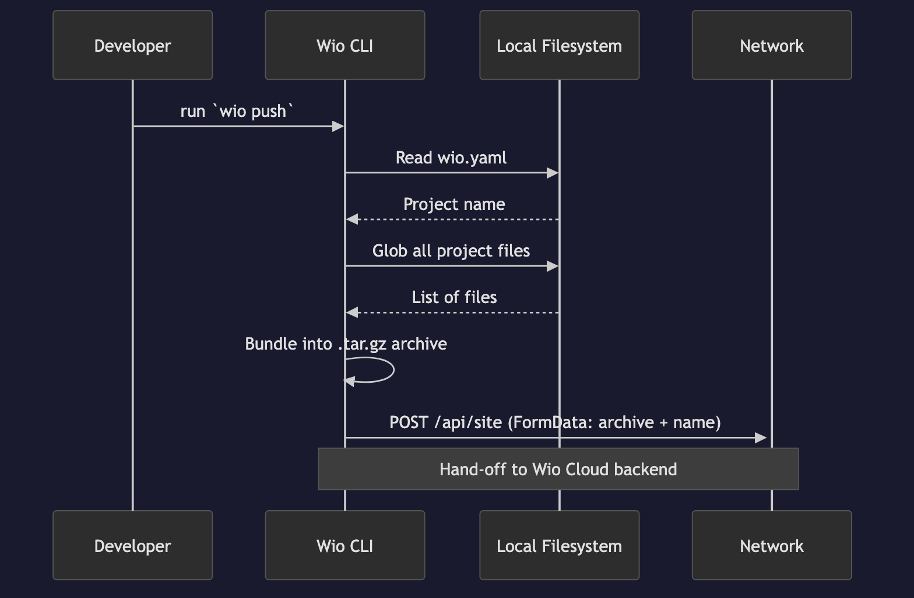
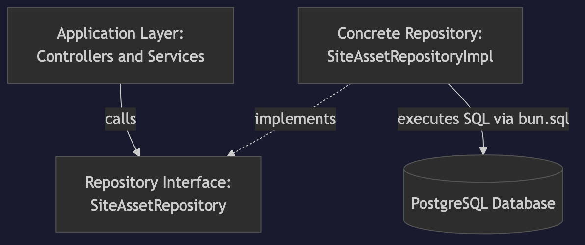

# Wio

**A backend-as-a-service platform for low-code and no-code developers, powered by AI.**

**[Landing page](https://wio.onl/)**

## Overview & Value Proposition

Wio is a platform that enables aspiring developers and entrepreneurs to build full-stack web applications without traditional backend programming expertise. By providing a simple, AI-agent-friendly API, Wio handles all backend complexity—database operations, authentication, real-time features, and deployment. Our goal is to empower users to generate full software platforms seamlessly by chatting with AI agents, bridging the gap between natural language ideas and deployed cloud infrastructure.

## Getting Started & Basic Instructions

### Try It Now (Deployed)

Our platform is actively deployed. No installation required to explore:

- **Landing Page:** https://wio.onl/
- **AI Demo:** https://ai.wio.onl/ — enter a prompt and receive a Gemma-powered AI response.
- **Real-Time Chat Demo:** https://chat.wio.onl/ — open in two tabs to see live WebSocket messaging.

### Developer Workflow

To test the full developer deployment pipeline locally:

1. Ensure you have [Bun](https://bun.sh/) installed.
2. Clone the repository and start the server (see [Local Installation](#local-installation) below).
3. In a new terminal, scaffold a project: `bun run cli/main.ts init my-demo-project`
4. Write your client-side application using the `wio.js` SDK (see [sample file](#feature-testing-walkthrough) below).
5. Deploy with: `cd my-demo-project && bun run ../cli/main.ts push`
6. Your site is instantly live at `my-demo-project.localhost:3000`.

### Local Installation

Install Bun:

```bash
curl -fsSL https://bun.sh/install | bash
```

Install dependencies:

```bash
bun install
```

### CLI

The CLI can be installed globally using:

```bash
bun link
```

### Development

Start the development server:

```bash
bun run dev
```

Start with Docker:

```bash
bun run up      # Start containers
bun run logs    # View logs
bun run down    # Stop containers
```

### Linting

```bash
bun run lint        # Check for issues
bun run lint:fix    # Fix issues automatically
```

## User Story: Zero-Configuration Application Deployment

**User Story:** As a user, I want to instantly initialize and deploy my application without configuring servers so that I can focus purely on writing frontend code.

The Wio CLI provides a seamless creation and deployment pipeline. By running terminal commands, developers generate a scaffolded project and push it to the Wio cloud instantly.

**Key Features:**

- `wio init project_name` instantly scaffolds a directory with a workspace configuration file (`wio.yaml`) and an AI instruction file (`AGENTS.md`).
- `wio push` completely bundles the client application and uploads it securely to the Wio backend.
- Projects are automatically assigned robust subdomain routing (e.g. `project_name.wio.dev`).

## System Architecture & Subteams

Because Wio provides a comprehensive Backend-as-a-Service, our team utilized a 3-layer architecture split to ensure deep focus on individual infrastructure components:

### 1. Frontend & CLI Interface

- **Subteam:** Jonathan Qiao, Mary Zhao
- **Focus:** The developer command-line upload pipeline (`wio push`) and public-facing web component UI building.

### 2. Backend Engine & Database Repositories

- **Subteam:** Yianni Culmone, Nicholas Koh, Milan Panta
- **Focus:** Core Postgres schema/models, User registration REST routes, Relation Repositories (handling raw SQL transactions), and the site upload/provisioning pipeline.

### 3. Client SDK & Integrations

- **Subteam:** Omid Hemmati, Ivan Chepelev
- **Focus:** The custom TypeScript-to-JS SDK transpiler, the `wio.js` database client library, server-side Socket.IO wrappers, and integration of the native LLM API functionality via `wio.ask()`.

## Architecture Overview (`wio push` Deployment Flow)

To understand how these layers interact, here is a global architectural walkthrough of our primary user story: the `wio push` zero-configuration deployment.

### Phase 1: Client Upload (CLI Layer)



When a developer runs the `wio push` command, the **Frontend & CLI Interface** subteam's architecture takes over. The CLI reads the `wio.yaml` configuration to determine the project name. It recursively globs the local project directory, bundling all HTML, CSS, JavaScript, and asset files into a compressed `.tar.gz` archive using Bun's built-in archiver. Finally, it sends this archive as `FormData` via a `POST` request to the Wio cloud's `/api/site` endpoint. This toolchain ensures developers never have to manually construct build pipelines or configure deployment targets.

### Phase 2: Engine Provisioning (Backend Engine Layer)


Upon receiving the `wio push` artifact at the `POST /api/site` endpoint, the flow shifts to the robust architecture built by the **Backend Engine & Database Repositories** subteam. The routing layer delegates to the backend orchestrator (`site.controller.ts`). The engine extracts the tarball into individual files, uploads each one to secure Object Storage via `s3.repository.ts`, and registers every file path in the `site_files` table. For re-deployments, existing files are cleaned from both S3 and the database before the new upload. This provisioning system ensures that deployed applications have all their assets reliably stored and retrievable via the platform's asset serving pipeline.

### Phase 3: Runtime Consumption (Client SDK Layer)


After the site is successfully deployed via `wio push`, the deployed frontend application running in the browser seamlessly consumes the dynamic `wio.js` SDK bundled by our transpiler. This is where the **Client SDK & Integrations** subteam's work completes the Backend-as-a-Service model. Their client SDK automatically establishes isolated, per-site WebSocket real-time connections back to the backend platform. Instead of developers writing their own complex integration and server logic, the SDK abstracts this away, securely formatting native database and AI operations into generic validated requests.

## Core Architectural Capabilities

Within the `wio push` deployed environment, our architecture provides several foundational patterns and platform capabilities to the developer.

### Repository Pattern Abstraction


To decouple our application logic from direct database queries, we implemented the Repository Pattern. Controllers interact only with defined interfaces (e.g., `SiteAssetRepository`), allowing our concrete implementations like `SiteAssetRepositoryImpl` to encapsulate raw SQL transactions exclusively.

### Real-Time WebSocket Gateway

The Wio platform provides a WebSocket gateway for real-time features in deployed applications. Each deployed site gets an isolated Socket.IO room, enabling peer-to-peer event broadcasting between connected clients.

**Key Features:**

- Per-site room isolation with automatic join/leave lifecycle management.
- General-purpose event broadcasting between connected clients via `wio.ws`.
- Scalable session management built using `fastify-socket.io`.

### Client-Side Database Provisioning

Wio intercepts SDK commands on the frontend and translates them into secure, isolated Postgres operations on the backend, allowing developers to treat the database as a native client-side object.

**Key Features:**

- `useRelation("table_name")` API automatically handles namespace isolation per-wio site.
- Native Javascript insertions and updates: `courses.insert({cNum: 301})`.
- Powerful querying via JSON-based filtering expressions.

### Integrated AI Functionality

The Wio platform acts as a secure proxy for the Google Gen AI API. Developers can execute LLM prompts natively through the frontend SDK without having to set up or secure their own API keys.

**Key Features:**

- Built-in `ask("prompt")` SDK method that returns a Promise resolving to the AI response.
- Secure proxying ensures client applications cannot expose root Gen AI API keys.

## Feature Testing Walkthrough

After starting the server with `bun run up`, you can test the full platform by deploying a sample application that uses the AI and WebSocket features.

**1. Scaffold a project:**

```bash
bun run cli/main.ts init sample-app
```

**2. Create `sample-app/index.html`** (run `touch sample-app/index.html`) and add the following content:

```html
<!DOCTYPE html>
<html lang="en">
  <head>
    <meta charset="UTF-8" />
    <title>Wio Sample App</title>
    <script type="module">
      import wio from "/wio.js";

      // --- AI Feature ---
      document.getElementById("ask-btn").onclick = async () => {
        const prompt = document.getElementById("prompt").value;
        const answer = await wio.ask(prompt);
        document.getElementById("ai-response").textContent = answer;
      };

      // --- WebSocket Feature ---
      wio.ws.onConnect(() => {
        document.getElementById("ws-status").textContent = "Connected";
      });
      wio.ws.on("chat", (data) => {
        const li = document.createElement("li");
        li.textContent = data.message;
        document.getElementById("messages").appendChild(li);
      });
      document.getElementById("send-btn").onclick = () => {
        const msg = document.getElementById("msg").value;
        wio.ws.emit("chat", { message: msg });
      };
    </script>
  </head>
  <body>
    <h1>Wio Sample App</h1>

    <h2>AI</h2>
    <input id="prompt" placeholder="Ask anything..." />
    <button id="ask-btn">Ask</button>
    <p id="ai-response"></p>

    <h2>WebSocket Chat</h2>
    <p>Status: <span id="ws-status">Disconnected</span></p>
    <input id="msg" placeholder="Type a message..." />
    <button id="send-btn">Send</button>
    <ul id="messages"></ul>
  </body>
</html>
```

**3. Deploy the app:**

```bash
cd sample-app
bun run ../cli/main.ts push
```

**4. Visit** `http://sample-app.localhost:3000` in your browser to test both features.

## Team Git & GitHub Workflow

Our team strictly adheres to a **Pull Request & Continuous Integration workflow**:

- **Feature Branches**: We build features on isolated branches (e.g. `feat/cli-upload` or `fix/jwt-auth`).
- **Required Pull Requests**: All changes must be made via PRs to `main`. Committing directly to `main` is disallowed.
- **CI/CD Triggers**: GitHub Actions run against every PR, executing our isolated database tests via Bun.
- **Approval Protocol**: PRs require at least 1 approval from a peer before merging. We've defined custom instructions for AI-assisted PR reviewing to make the review process more comprehensive.
- **Project Board**: We map our User Stories to individual issues and track assignments via the GitHub Kanban board.

## Hosting on teach.cs (Optional)

Wio can be deployed on UofT's teach.cs servers using `udocker` (a user-mode Docker alternative that doesn't require root access).

### First-time Setup

1. **SSH into teach.cs:**

   ```bash
   ssh <utorid>@teach.cs.toronto.edu
   ```

2. **Clone the repository:**

   ```bash
   git clone https://github.com/csc301-2026-s/project-make-no-mistake.git
   cd project-make-no-mistake
   ```

3. **Install udocker:**

   ```bash
   ./install_udocker.sh
   source ~/.bashrc
   ```

4. **Pull required images (first time only):**
   ```bash
   udocker pull postgres:16-alpine
   udocker pull minio/minio:latest
   udocker pull oven/bun:latest
   udocker create --name=wio-web oven/bun:latest
   ```

### Running the Server

Use the management script to start/stop the server:

```bash
./manage.sh
```

You'll see a menu with three options:

| Option                 | Description                              |
| ---------------------- | ---------------------------------------- |
| **1) Start Server**    | Starts all services, keeps existing data |
| **2) Full Restart**    | Wipes data folders, fresh start          |
| **3) Nuclear Restart** | Wipes data AND recreates containers      |

### Accessing the Server

Once running, the server is accessible at:

- **Web App:** `http://teach.cs.toronto.edu:3000`
- **MinIO Console:** `http://teach.cs.toronto.edu:19001`

### Viewing Logs

Check the log files for debugging:

```bash
tail -f postgres.log   # PostgreSQL logs
tail -f minio.log      # MinIO logs
```

### Stopping the Server

The easiest way is to run `./manage.sh` again - it will clean up existing processes before starting new ones. Alternatively:

```bash
pkill -u $(whoami) -f "postgres|minio|bun"
```

## Team

| Member         | Role                 | GitHub                                             |
| -------------- | -------------------- | -------------------------------------------------- |
| Omid Hemmati   | Full Stack Developer | [@hemmatio](https://github.com/hemmatio)           |
| Mary Zhao      | Frontend Developer   | [@mariimao](https://github.com/mariimao)           |
| Yianni Culmone | Backend Developer    | [@CulmoneY](https://github.com/CulmoneY)           |
| Nicholas Koh   | Full Stack Developer | [@kohnicholas1](https://github.com/kohnicholas1)   |
| Ivan Chepelev  | Backend Developer    | [@ch-iv](https://github.com/ch-iv)                 |
| Milan Panta    | Full Stack Developer | [@milan-panta](https://github.com/milan-panta)     |
| Jonathan Qiao  | Full Stack Developer | [@jonathanqiao1](https://github.com/jonathanqiao1) |

## Technology Stack

- **Runtime:** Bun
- **Backend:** Fastify
- **Language:** TypeScript
- **Database:** PostgreSQL + JSON
- **Testing:** Bun's built-in test library

## External Dependencies

- Google Gen AI API (for AI features)
- PostgreSQL (database)

## License

**MIT License** - see [LICENSE](LICENSE) for details.

_Reasoning: We chose the MIT License because Wio is an educationally-driven open-source abstraction layer. By using MIT, we allow maximum flexibility for users to build their own no-code applications on top of our SDK, push them to production, and potentially fork the underlying platform for enterprise deployment without strict copyleft restrictions._

---

_CSC301 - Team 21: Make No Mistake_
