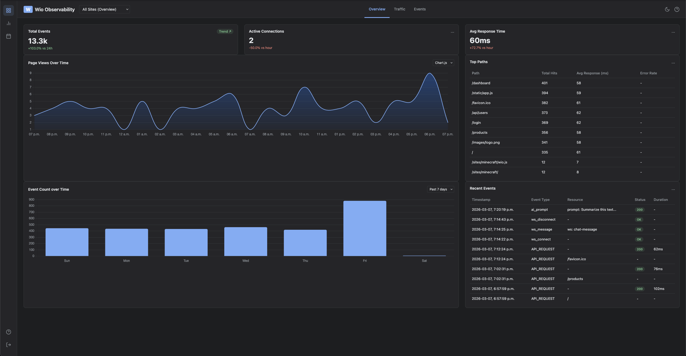
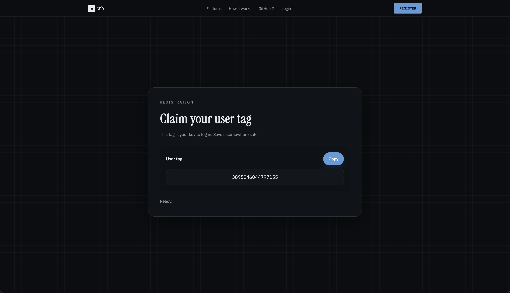
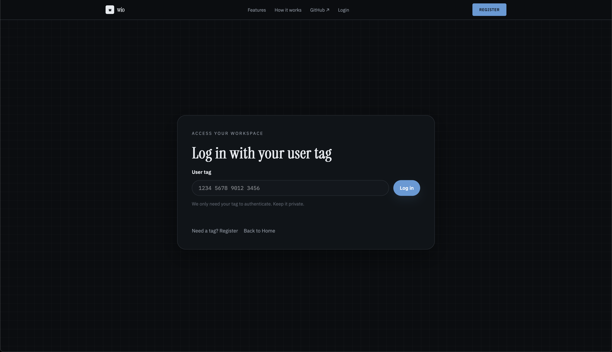
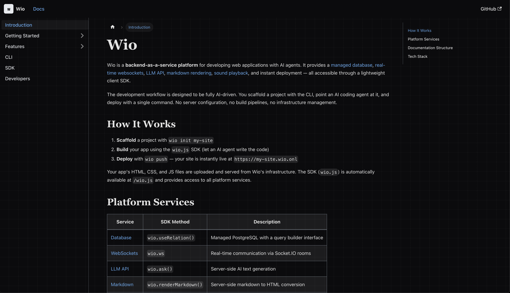
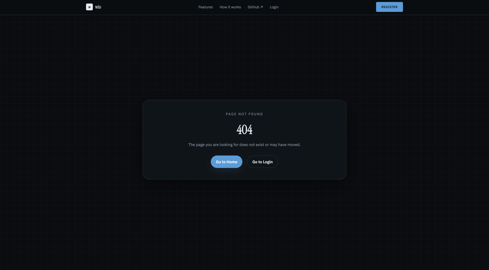

# Wio – Product Evolution (D3)

## 1. What Needed to Improve

After D2, Wio had four critical gaps that prevented it from functioning as a cohesive platform.

1. **no observability**: developers deployed sites via `wio push` but had zero visibility into HTTP traffic, WebSocket connections, or AI API usage; they were deploying into a black box.
2. **no authentication**: anyone could push to any site name, and there was no concept of ownership or identity tying a developer to their deployments.
3. **missing database surface**: the SDK had no database support, meaning developers had no way to persist or retrieve data, leaving the managed database entirely inaccessible to sites.
4. **limited CLI distribution**: the CLI required Bun as a runtime, limiting adoption to developers already using Bun rather than the broader Node.js/npm ecosystem.

On top of these functional gaps, our documentation was fragmented across multiple ad-hoc pages with several links breaking during an unfortunate domain migration (`noivan.dev → wio.onl`) that coincided with the D2 grading period. The TA feedback explicitly noted: (1) the landing page and associated pages failed to load, (2) the Gemma AI demo and chat app felt detached from the core product, and (3) non-integrated functionalities made it difficult to follow our vision and approach.

We identified these gaps through three complementary channels. First, the D2 grading feedback quantified the problem: our Instruction Clarity score (80) and Functionality score (85) confirmed that evaluators couldn't clearly see how our components fit together. Second, internal pair debugging sessions revealed that once a site was pushed via `wio push`, the developer had no next step: no dashboard, no metrics, no feedback loop. Third, team retrospective discussions highlighted that the "front-end seems mostly detached from the backend" was exactly the perception gap we needed to close: Wio's value proposition is the _platform_, not any individual sample site.

## 2. What You Did

D3 addressed each of the four gaps identified above through targeted, integrated improvements:

### Comprehensive Observability Dashboard (PR [#148](https://github.com/csc301-2026-s/project-21-make-no-mistake/pull/148))

We built a full observability suite that automatically intercepts and logs three categories of platform events:

- **HTTP Request Telemetry**: Every request hitting a deployed Wio site is logged with method, status code, path, response time, and timestamps.
- **WebSocket Event Telemetry**: Connection events, message counts, and room activity for real-time applications.
- **AI LLM Telemetry**: Every `wio.ask()` SDK call is instrumented, capturing prompt metadata, token counts, and latency.

The dashboard is accessible at `wio.onl/dashboard` and provides both real-time and historical views. Architecturally, this required a new `log.repository.ts` layer, a `metrics.controller.ts` API surface, and frontend visualization using chart rendering. A significant integration challenge was handling production data format differences: PostgreSQL `JSONB` columns stored metadata differently in production vs. development, which we discovered and fixed in PR [#159](https://github.com/csc301-2026-s/project-21-make-no-mistake/pull/159).

### Authentication & Site Ownership (PRs [#140](https://github.com/csc301-2026-s/project-21-make-no-mistake/pull/140), [#168](https://github.com/csc301-2026-s/project-21-make-no-mistake/pull/168))

We implemented a complete authentication layer that was entirely absent in D2. The `wio login <user-tag>` command authenticates developers via JWT, and `wio register` opens the registration page directly from the terminal. Sites pushed via `wio push` are now associated with authenticated users, establishing proper ownership. The observability dashboard filters metrics by the logged-in user, and protected sites can only be updated by their owner. This was foundational. Without authentication, no other D3 feature (observability, dashboard, site management) could be scoped to the correct developer.

### Database CRUD Completion & SDK Expansion (PRs [#154](https://github.com/csc301-2026-s/project-21-make-no-mistake/pull/154), [#169](https://github.com/csc301-2026-s/project-21-make-no-mistake/pull/169), [#142](https://github.com/csc301-2026-s/project-21-make-no-mistake/pull/142), [#145](https://github.com/csc301-2026-s/project-21-make-no-mistake/pull/145))

In D2, the managed database was entirely inaccessible through the SDK — developers had no way to write or read data. This was a fundamental product gap: a web platform without data persistence is unusable for real applications. We built the core database engine, a `selectQueryBuilder` helper, and `selectRelations` implementation (PR [#154](https://github.com/csc301-2026-s/project-21-make-no-mistake/pull/154)) that expose `useRelation("table").insert()` and `useRelation("table").select()` in the frontend SDK, establishing the CRUD surface. This was validated end-to-end with a complete todo demo application (PR [#169](https://github.com/csc301-2026-s/project-21-make-no-mistake/pull/169)) — the first Wio site that reads and writes data through the full stack.

Alongside the database work, we extended the SDK with:

- **Audio Player** (`wio.playSound()`): Allows sites to play audio assets.
- **UI Components** (`wio.createModal()`, `wio.createButton()`): Pre-built UI primitives that AI agents can use to build interactive interfaces.

### CLI Distribution & NPM Publishing (PRs [#80](https://github.com/csc301-2026-s/project-21-make-no-mistake/pull/80), [#130](https://github.com/csc301-2026-s/project-21-make-no-mistake/pull/130), [#172](https://github.com/csc301-2026-s/project-21-make-no-mistake/pull/172), [#173](https://github.com/csc301-2026-s/project-21-make-no-mistake/pull/173), [#175](https://github.com/csc301-2026-s/project-21-make-no-mistake/pull/175))

The CLI did not exist as a distributable package in D2, it was only runnable from a local clone of the repository. We first packaged it for NPM and created a GitHub Actions workflow to automate publishing (PRs [#80](https://github.com/csc301-2026-s/project-21-make-no-mistake/pull/80), [#130](https://github.com/csc301-2026-s/project-21-make-no-mistake/pull/130)). Additionally, we refactored the entire CLI to be runtime-agnostic, supporting both Bun and Node.js (PR [#172](https://github.com/csc301-2026-s/project-21-make-no-mistake/pull/172)). This required abstracting Bun-specific filesystem APIs, fixing the NPM publish workflow (PR [#173](https://github.com/csc301-2026-s/project-21-make-no-mistake/pull/173)), and replacing symlinks with file copies for Windows compatibility (PR [#175](https://github.com/csc301-2026-s/project-21-make-no-mistake/pull/175)). The CLI is now published as [`wio-cli`](https://www.npmjs.com/package/wio-cli), installable with `npm i -g wio-cli` — transforming it from an internal development tool into a publicly distributable product.

### Unified Docusaurus Documentation (PRs [#150](https://github.com/csc301-2026-s/project-21-make-no-mistake/pull/150), [#151](https://github.com/csc301-2026-s/project-21-make-no-mistake/pull/151), [#160](https://github.com/csc301-2026-s/project-21-make-no-mistake/pull/160))

We consolidated all fragmented documentation into a single Docusaurus site served at `/docs/`. This covers the complete Wio developer manual: getting started guides, SDK API reference (database, websockets, LLM, sound player, markdown renderer, modals), CLI command reference, and architecture overview. A notable integration challenge was routing Docusaurus static pages through our Fastify server — sub-pages like `/docs/features/websockets` required configuring `extensions: ["html"]` in the Fastify static plugin to resolve correctly without explicit `.html` extensions.

### Error Handling & Polish (PRs [#171](https://github.com/csc301-2026-s/project-21-make-no-mistake/pull/171), [#167](https://github.com/csc301-2026-s/project-21-make-no-mistake/pull/167), [#170](https://github.com/csc301-2026-s/project-21-make-no-mistake/pull/170), [#141](https://github.com/csc301-2026-s/project-21-make-no-mistake/pull/141))

- Custom 404 page for missing site subdomains.
- Safe redirection on missing/deleted user sessions (no more 500 errors on stale cookies).
- Conditional login redirection with `returnTo` parameter.
- CLI pretty printing for better developer UX.

## 3. Before vs. After

| Dimension            | Before (D2)                                           | After (D3)                                                                                          |
| -------------------- | ----------------------------------------------------- | --------------------------------------------------------------------------------------------------- |
| **Observability**    | None. Developers deploy and hope.                     | Full dashboard at `/dashboard` with HTTP, WebSocket, and AI telemetry charts.                       |
| **Documentation**    | Fragmented pages, broken links from domain migration. | Unified Docusaurus at `/docs/` with complete SDK, CLI, and architecture docs.                       |
| **CLI Onboarding**   | `wio push` only. No auth. Bun-only.                   | `wio init` → `wio register` → `wio login` → `wio push`. Works with both npm and Bun.                |
| **SDK Completeness** | No database support, WebSockets, LLM.                 | Full CRUD (select + insert), audio, modals, buttons.                                                |
| **Error Handling**   | Raw 500 errors on edge cases.                         | Custom 404 pages, safe session redirects, validated route params.                                   |
| **Product Cohesion** | "Non-integrated functionalities" (D2 feedback).       | Clear end-to-end workflow: register → login → init → develop with AI → push → monitor on dashboard. |

The most concrete improvement is workflow completeness: a developer can now `npm i -g wio-cli`, register, authenticate, initialize a site, develop with an AI agent, deploy, and monitor their application, all without leaving the terminal or browser. Each of the four D3 pillars (observability, authentication, database CRUD, CLI distribution) was essential to making this end-to-end workflow possible.

## 4. Reflection

**What worked well:** Our PR-based workflow with mandatory peer reviews proved its value during D3. With 30+ PRs merged across the team, the review process caught several integration issues early, notably the JSONB data format bug that would have silently corrupted production metrics. The ChatOps-style CI trigger (`/ci` comment) conserved our limited GitHub Actions minutes while maintaining automated quality gates.

**What was harder than expected:** Our decision to use PostgreSQL for its efficiency and relational guarantees introduced persistent friction when handling JSON data across the platform. Wio provisions isolated per-site database schemas where user data is stored in dynamically-created `JSONB` columns. This powers the `useRelation("table").insert()` and `useRelation("table").select()` SDK surface. However, values retrieved from `JSONB` columns consistently lost their natural type casting: numbers, booleans, and other non-string types were all being returned as plain strings. A developer would insert `{ "count": 42, "active": true }` and get back `{ "count": "42", "active": "true" }`. These issues compounded in the per-site databases because each site's schema is created at runtime from user-defined data, meaning we couldn't predict or enforce column types ahead of time. The same class of bugs hit our observability layer, where log metadata was being double-stringified — `JSONB` stored `"\"some string\""` instead of `"some string"` — causing the dashboard to silently render incorrect data (PR [#159](https://github.com/csc301-2026-s/project-21-make-no-mistake/pull/159)). Debugging these issues required tracing data across multiple architectural layers (SDK → Fastify lifecycle → repository → database → API response), and the fixes were often small once found but the diagnosis was time-consuming. This shined light on the tradeoffs in using a strictly-typed relational database to store schemaless, user-generated data at the core of a backend-as-a-service. Separately, the CLI presented its own class of environment-dependent issues. Users who installed `wio-cli` without Bun on their system would encounter failures, since the package silently depended on Bun-specific APIs. Diagnosing these required reproducing the problem across different runtime environments, and the fix ultimately demanded a full runtime-agnostic refactor rather than a simple patch (PR [#172](https://github.com/csc301-2026-s/project-21-make-no-mistake/pull/172)).

**Path to D4:** Our core infrastructure is now solid: deployment pipeline, database engine, WebSocket system, AI proxy, observability, and documentation are all functional and integrated. For D4, we plan to: (1) expand test coverage beyond the current 23 test files with additional integration tests for the new observability and auth flows, (2) launch the site marketplace feature (currently in PR), and (3) add coverage reporting to CI. The remaining work is feasible given our current velocity and the stability of our platform foundations.
