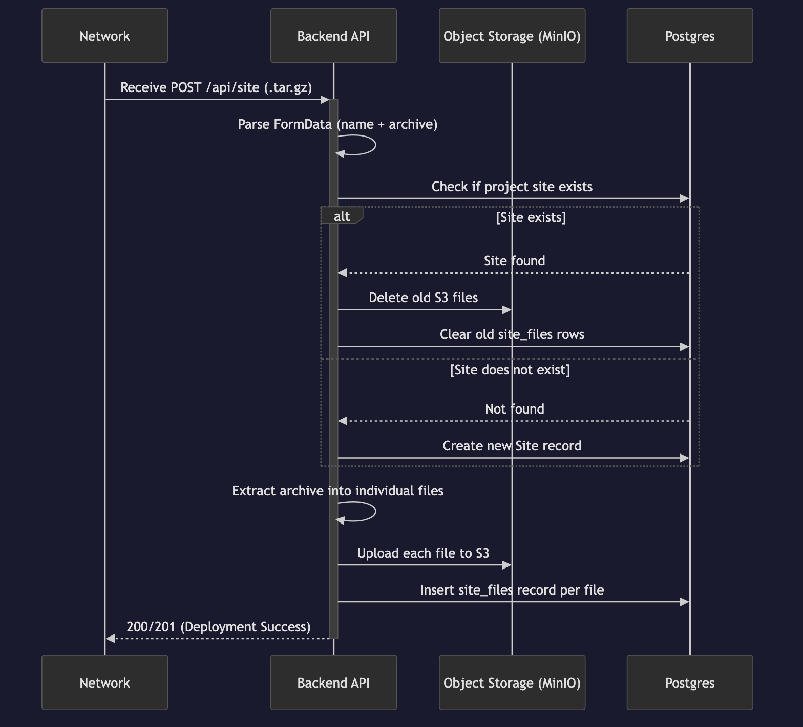
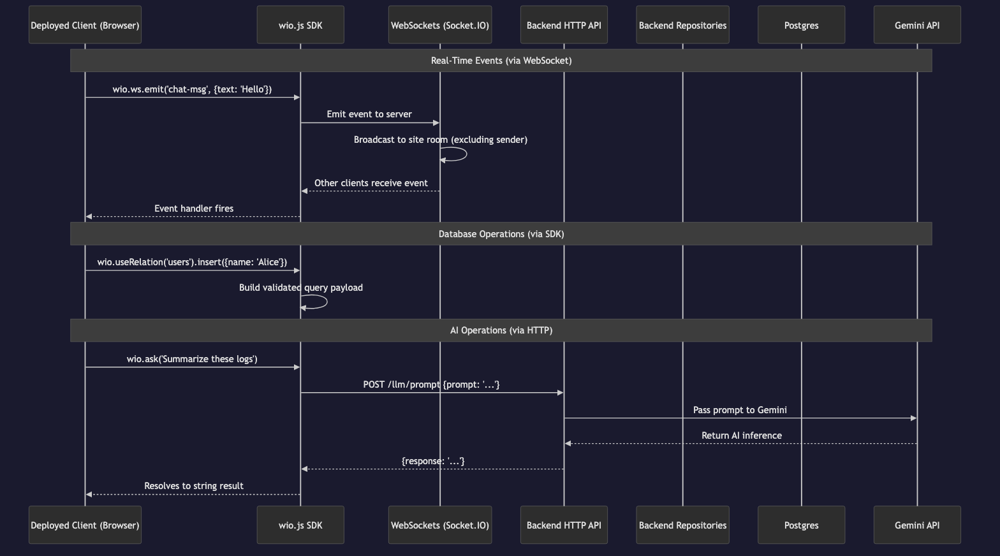

## System Architecture & Subteams

Because Wio provides a comprehensive Backend-as-a-Service, our team utilized a 3-layer architecture split to ensure deep focus on individual infrastructure components:

### 1. Frontend & CLI Interface

- **Subteam:** Jonathan Qiao, Mary Zhao
- **Focus:** The developer command-line upload pipeline (`wio push`) and public-facing web component UI building.

### 2. Backend Engine & Database Repositories

- **Subteam:** Yianni Culmone, Nicholas Koh, Milan Panta
- **Focus:** Core Postgres schema/models, User registration REST routes, Relation Repositories (handling raw SQL transactions), and the site upload/provisioning pipeline.

### 3. Client SDK & Integrations

- **Subteam:** Omid Hemmati, Ivan Chepelev
- **Focus:** The custom TypeScript-to-JS SDK transpiler, the `wio.js` database client library, server-side Socket.IO wrappers, and integration of the native LLM API functionality via `wio.ask()`.

## Architecture Overview (`wio push` Deployment Flow)

To understand how these layers interact, here is a global architectural walkthrough of our primary user story: the `wio push` zero-configuration deployment.

### Phase 1: Client Upload (CLI Layer)


When a developer runs the `wio push` command, the **Frontend & CLI Interface** subteam's architecture takes over. The CLI reads the `wio.yaml` configuration to determine the project name. It recursively globs the local project directory, bundling all HTML, CSS, JavaScript, and asset files into a compressed `.tar.gz` archive using Bun's built-in archiver. Finally, it sends this archive as `FormData` via a `POST` request to the Wio cloud's `/api/site` endpoint. This toolchain ensures developers never have to manually construct build pipelines or configure deployment targets.

### Phase 2: Engine Provisioning (Backend Engine Layer)



Upon receiving the `wio push` artifact at the `POST /api/site` endpoint, the flow shifts to the robust architecture built by the **Backend Engine & Database Repositories** subteam. The routing layer delegates to the backend orchestrator (`site.controller.ts`). The engine extracts the tarball into individual files, uploads each one to secure Object Storage via `s3.repository.ts`, and registers every file path in the `site_files` table. For re-deployments, existing files are cleaned from both S3 and the database before the new upload. This provisioning system ensures that deployed applications have all their assets reliably stored and retrievable via the platform's asset serving pipeline.

### Phase 3: Runtime Consumption (Client SDK Layer)



After the site is successfully deployed via `wio push`, the deployed frontend application running in the browser seamlessly consumes the dynamic `wio.js` SDK bundled by our transpiler. This is where the **Client SDK & Integrations** subteam's work completes the Backend-as-a-Service model. Their client SDK automatically establishes isolated, per-site WebSocket real-time connections back to the backend platform. Instead of developers writing their own complex integration and server logic, the SDK abstracts this away, securely formatting native database and AI operations into generic validated requests.

## Core Architectural Capabilities

Within the `wio push` deployed environment, our architecture provides several foundational patterns and platform capabilities to the developer.

### Repository Pattern Abstraction


To decouple our application logic from direct database queries, we implemented the Repository Pattern. Controllers interact only with defined interfaces (e.g., `SiteAssetRepository`), allowing our concrete implementations like `SiteAssetRepositoryImpl` to encapsulate raw SQL transactions exclusively.

### Real-Time WebSocket Gateway

The Wio platform provides a WebSocket gateway for real-time features in deployed applications. Each deployed site gets an isolated Socket.IO room, enabling peer-to-peer event broadcasting between connected clients.

**Key Features:**

- Per-site room isolation with automatic join/leave lifecycle management.
- General-purpose event broadcasting between connected clients via `wio.ws`.
- Scalable session management built using `fastify-socket.io`.

### Client-Side Database Provisioning

Wio intercepts SDK commands on the frontend and translates them into secure, isolated Postgres operations on the backend, allowing developers to treat the database as a native client-side object.

**Key Features:**

- `useRelation("table_name")` API automatically handles namespace isolation per-wio site.
- Native Javascript insertions and updates: `courses.insert({cNum: 301})`.
- Powerful querying via JSON-based filtering expressions.

### Integrated AI Functionality

The Wio platform acts as a secure proxy for the Google Gen AI API. Developers can execute LLM prompts natively through the frontend SDK without having to set up or secure their own API keys.

**Key Features:**

- Built-in `ask("prompt")` SDK method that returns a Promise resolving to the AI response.
- Secure proxying ensures client applications cannot expose root Gen AI API keys.

## Feature Testing Walkthrough

After starting the server with `bun run up`, you can test the full platform by deploying a sample application that uses the AI and WebSocket features.

**1. Scaffold a project:**

```bash
bun run cli/main.ts init sample-app
```

**2. Create `sample-app/index.html`** (run `touch sample-app/index.html`) and add the following content:

```html
<!DOCTYPE html>
<html lang="en">
  <head>
    <meta charset="UTF-8" />
    <title>Wio Sample App</title>
    <script type="module">
      import wio from "/wio.js";

      // --- AI Feature ---
      document.getElementById("ask-btn").onclick = async () => {
        const prompt = document.getElementById("prompt").value;
        const answer = await wio.ask(prompt);
        document.getElementById("ai-response").textContent = answer;
      };

      // --- WebSocket Feature ---
      wio.ws.onConnect(() => {
        document.getElementById("ws-status").textContent = "Connected";
      });
      wio.ws.on("chat", (data) => {
        const li = document.createElement("li");
        li.textContent = data.message;
        document.getElementById("messages").appendChild(li);
      });
      document.getElementById("send-btn").onclick = () => {
        const msg = document.getElementById("msg").value;
        wio.ws.emit("chat", { message: msg });
      };
    </script>
  </head>
  <body>
    <h1>Wio Sample App</h1>

    <h2>AI</h2>
    <input id="prompt" placeholder="Ask anything..." />
    <button id="ask-btn">Ask</button>
    <p id="ai-response"></p>

    <h2>WebSocket Chat</h2>
    <p>Status: <span id="ws-status">Disconnected</span></p>
    <input id="msg" placeholder="Type a message..." />
    <button id="send-btn">Send</button>
    <ul id="messages"></ul>
  </body>
</html>
```

**3. Deploy the app:**

```bash
cd sample-app
bun run ../cli/main.ts push
```

**4. Visit** `http://sample-app.localhost:3000` in your browser to test both features.
